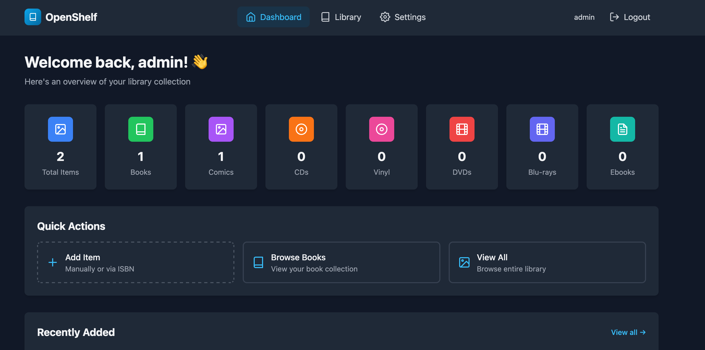
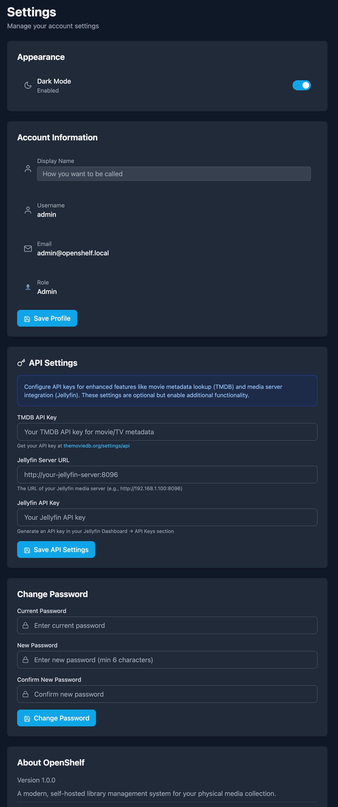

# OpenShelf 📚

A modern, self-hosted library management system for your physical media collection.

## Features

- 📖 **Books & Comics** - Add books and comics via ISBN/barcode scanning with automatic metadata lookup
- � **Comic Vine Integration** - Automatic comic metadata, cover art, and details from Comic Vine database
- �💿 **Music Media** - Manage CDs and vinyl records with support for label, catalog number, and track information
- 📀 **Video Media** - Catalog DVDs and Blu-rays with TMDB movie database integration
- 📱 **Digital Books** - Add and store EPUB and PDF ebooks with file upload support
- 🎵 **Multi-Format Support** - Books, Comics, CDs, Vinyl, DVDs, Blu-rays, Ebooks, and custom "Other" category
- 📸 **Image Upload** - Add cover art by uploading photos or providing URLs
- 📱 **Barcode Scanner** - Use your device camera or upload barcode photos for quick ISBN lookup
- 🎬 **TMDB Integration** - Automatic movie and TV show metadata lookup for video media
- 🎵 **Jellyfin Integration** - Connect to your Jellyfin media server to link and play media directly
- ❤️ **Wishlist** - Track items you want to acquire with dedicated wishlist management
- 📊 **Statistics & Insights** - Visual analytics with charts showing collection trends, top creators, and more
- 💾 **Import/Export** - Backup and restore your collection data in CSV or JSON format
- 🔍 **Advanced Search & Filters** - Multi-parameter filtering including tags, ratings, dates, and more
- 🎨 **Modern UI** - Clean, responsive interface built with React and Tailwind CSS
- 🌙 **Dark Mode** - Full dark mode support with persistent theme preference
- 👥 **User Management** - Multi-user support with authentication and display names
- 🔍 **Search & Filter** - Easily find items in your collection by title, creators, ISBN, or barcode
- 🏷️ **Flexible Metadata** - Support for multiple creator roles (author, artist, singer, director, etc.)
- 🐳 **Self-Hostable** - Run it yourself with Docker
- 💾 **Simple Storage** - SQLite database (easy to backup and manage)
- 🔌 **Extensible** - JSON metadata fields for custom data per media type

## Screenshots

<div align="center">
  
  <p><em>Dashboard with collection overview</em></p>
  
  
  <p><em>Library view with filtering options</em></p>
</div>

## Quick Start

### Using Docker (Recommended)

1. Clone the repository and navigate to the project directory
2. Start the application:
   ```bash
   docker-compose up -d
   ```
3. Access the application at `http://localhost:3000`

**Default credentials:**
- Username: `admin`
- Password: `admin`

⚠️ **Important:** Change the default admin password after first login!

### Accessing from Mobile Devices

To access OpenShelf from your phone or tablet on the same network:

1. Find your computer's local IP address:
   - **macOS/Linux:** Run `ifconfig | grep "inet "` or `ip addr show`
   - **Windows:** Run `ipconfig`
   - Look for something like `192.168.1.xxx` or `10.0.0.xxx`

2. Access OpenShelf using your IP address:
   ```
   http://YOUR_IP_ADDRESS:3000
   ```
   For example: `http://192.168.1.100:3000`

3. The backend API will automatically be accessible at port 3001

**Note:** Make sure your firewall allows incoming connections on ports 3000 and 3001.

## Quick Start

### Using Docker Compose (Recommended)

```bash
# Clone the repository
git clone https://github.com/william-sy/OpenShelf.git
cd openshelf

# Start the application
docker-compose up -d

# Access at http://localhost:3000
```

### Development Setup

#### Backend
```bash
cd backend
npm install
npm run dev
```

#### Frontend
```bash
cd frontend
npm install
npm run dev
```

## Configuration

### API Keys Configuration (Recommended)

The easiest way to configure API keys is through the **Settings page** in the web interface:

1. Log in to OpenShelf
2. Go to Settings (click your username in the top right)
3. Scroll to the "API Settings" section
4. Enter your API keys:
   - **TMDB API Key** - For movie/TV metadata lookup
   - **Jellyfin URL** - Your Jellyfin server address (e.g., `http://192.168.1.100:8096`)
   - **Jellyfin API Key** - For media server integration
   - **Comic Vine API Key** - For comic book metadata lookup
5. Click "Save API Settings"

### Environment Variables (Alternative)

You can also set default API keys via environment variables. Create a `.env` file in the project root:

```bash
# Copy the example file
cp .env.example .env
```

Available environment variables:

```env
# Backend Configuration
JWT_SECRET=your-secret-key-change-this
DATABASE_PATH=./database/openshelf.db

# Optional: Default API keys (users can override these in Settings)
TMDB_API_KEY=your_tmdb_api_key_here
JELLYFIN_URL=http://your-jellyfin-server:8096
JELLYFIN_API_KEY=your_jellyfin_api_key_here
COMICVINE_API_KEY=your_comicvine_api_key_here

# Frontend Configuration
# Leave empty for automatic detection (localhost, LAN IP)
# Set for production behind reverse proxy (e.g., https://your-domain.com)
VITE_API_URL=
```

**Note:** When `VITE_API_URL` is empty, the frontend automatically detects the API URL based on the current hostname. This works for:
- Local development (`http://localhost:3001`)
- LAN access (`http://192.168.1.100:3001`)
- Custom domains with dynamic API detection

Set `VITE_API_URL` when deploying behind a reverse proxy (nginx, Caddy, etc.) where the API is served from the same domain.

After modifying `.env`, rebuild the containers:
```bash
docker-compose build
docker-compose up -d
```

### Getting API Keys

**TMDB API Key:**
1. Create a free account at [themoviedb.org](https://www.themoviedb.org/)
2. Go to Settings > API
3. Request an API key (select "Developer" option)
4. Copy your API Key (v3 auth) to the Settings page or `TMDB_API_KEY` environment variable

**Jellyfin API Key:**
1. Open your Jellyfin web interface
2. Go to Dashboard > API Keys
3. Click the + button to create a new API key
4. Name it "OpenShelf" and save
5. Copy the generated key to the Settings page or `JELLYFIN_API_KEY` environment variable

**Comic Vine API Key:**
1. Create a free account at [comicvine.gamespot.com](https://comicvine.gamespot.com/)
2. Go to [API page](https://comicvine.gamespot.com/api/)
3. Request an API key
4. Copy your API key to the Settings page or `COMICVINE_API_KEY` environment variable

## Default Login

- **Username**: admin
- **Password**: admin

⚠️ **Please change the default password after first login!**

## Tech Stack

- **Backend**: Node.js, Express, SQLite (better-sqlite3)
- **Frontend**: React 18, Vite, Tailwind CSS, Zustand
- **APIs**: Open Library, Google Books, TMDB, Jellyfin (optional)
- **Auth**: JWT with bcrypt
- **Deployment**: Docker with multi-stage builds

## Roadmap

### v1.0 (Current)
- [x] User authentication with display names
- [x] Book & Comic management with ISBN lookup
- [x] Comic Vine API integration for comic metadata
- [x] CD, Vinyl, DVD, Blu-ray support
- [x] Ebook support (EPUB/PDF)
- [x] TMDB integration for movies/TV
- [x] Jellyfin integration for media playback
- [x] Barcode scanning with camera and file upload
- [x] Dark mode with persistent theme
- [x] Modern responsive UI
- [x] Docker deployment
- [x] Mobile-friendly access
- [x] Import/Export functionality (CSV, JSON)
- [x] Statistics and collection insights with visual charts
- [x] Wishlist feature for tracking items to acquire
- [x] Advanced search and filters (multi-parameter, date ranges, ratings)

### Future Features
- [ ] Lending system with due dates and reminders
- [ ] MusicBrainz integration for music metadata
- [ ] Mobile app (iOS/Android)? (browser works fine for now)

## License

MIT License - See LICENSE file for details

## Contributing

Contributions are welcome! Please open an issue or submit a pull request.
